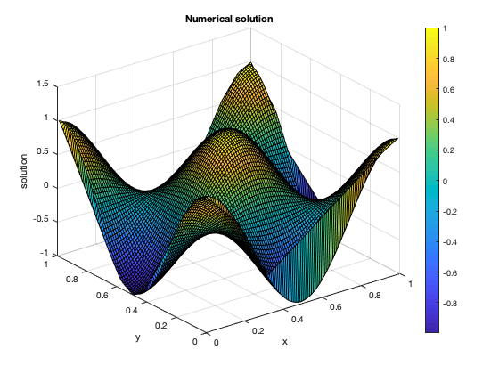

# 2Dlinconv

A 2D linear convection solver using Summation-By-Parts (SBP) discretization methods written in MATLAB.

SBP methods are very similar to Discontinuous Galerkin (DG) finite-element methods. This solver uses upwind numerical fluxes to add dissipation at element interfaces and the fourth-order Runge-Kutta (RK4) method as its time-marching scheme.

For the grid generation, [DistMesh](http://persson.berkeley.edu/distmesh/) is used.

## Installation
Clone the repository:
```console
git clone https://github.com/siavashadpey/2Dlinconv.git
```

Open MATLAB and `cd` into the directory you just cloned and run the setup file on MATLAB's Command Window:
```console
setup
```

## Example
You can run a pre-existing test case via the Command Window:
```console
lin_conv_2D
```
which simulates a 2D sinusoidal wave convecting at a constant speed of 0.5 in each direction on a unit square until a final time of T=0.5. The mesh spacing used is 1/12, the time-step is 0.005, and the SBP operator is an Omega operator of degree 3.

The numerical and exact solutions are shown below:




Via this driver file's arguments, you can modify the type and the degree of the SBP operator, the type of linear convection problem, the wave speed, and the mesh spacing and time-step.

Finally, you can also run convergence studies to test the solver by executing:
```console
conv_study
```
